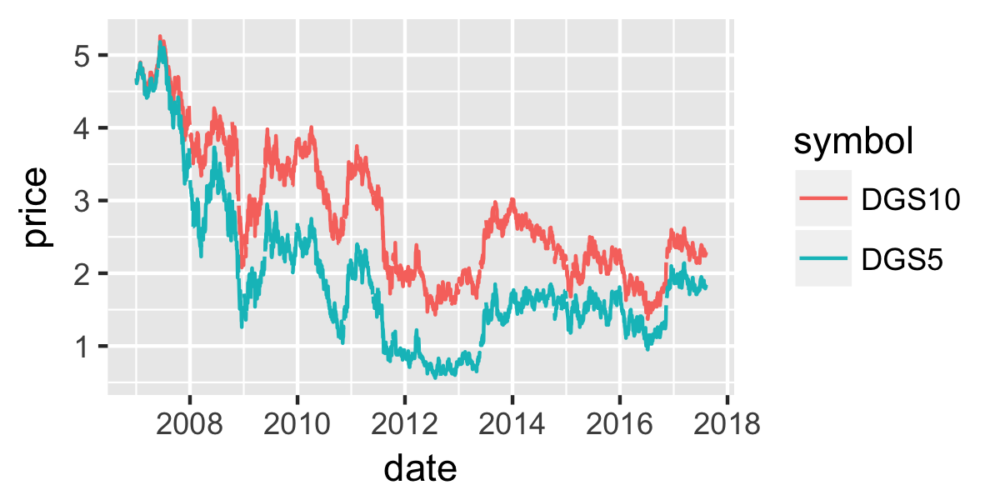

```{r setup, message=FALSE, warning=FALSE, include=FALSE}
library(tidyquant)
```

class: dv

# Introduction

* Who are we? 

--

* What is tidyquant?

--

* What will you learn today?
  
---

class: dv

# tq_get()

--

* Historical stock prices

* Company financials

* Exchange rates

* And many others!

---

class: dv

# tq_get() - Example

```{r}
tq_get(x = "AAPL", get = "stock.prices")
```

  
---

class: dv

# tq_get() - Arguments

```{r tq_get args}
args(tq_get)
```

<br>

* _x_ - A character vector, or tibble of the symbols you would like to pull information for

--

* _get_ - A character vector representing the type of data to pull for `x`

--

* _complete_cases_ - Whether to remove symbols that throw an error during the call to `tq_get()`

--

<br>

```{r, eval = FALSE}
?tq_get
```


---

class: dv

# tq_get() - Example

```{r}
# 5 & 10 Year Treasury rates
treasury <- tq_get(x   = c("DGS5", "DGS10"), 
                   get = "economic.data")
```

```{r}
treasury
```


---

class: dv

# tq_get() - Example

```{r}
# 5 & 10 Year Treasury rates
treasury <- tq_get(x   = c("DGS5", "DGS10"), 
                   get = "economic.data")
```

.pull-left[

```{r}
treasury %>%
  group_by(symbol) %>%
  count()
```

]

--

.pull-right[

```{r, eval=FALSE}
treasury %>%
  ggplot(aes(x = date, 
             y = price, 
             color = symbol)) +
  geom_line()
```



]

---

class: dv

# Much more to come!

* _tq_mutate_ - Manipulate data using financial functions

* _tq_performance_ - An integration with PerformanceAnalytics

* _Scalability_ - Working with a large number of assets at once

---

class: dv, middle, center

# Thank you!