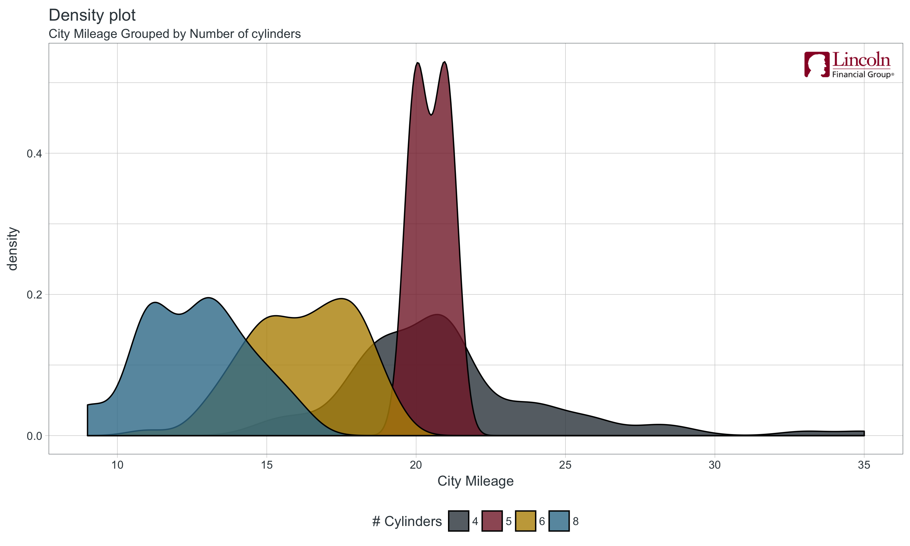
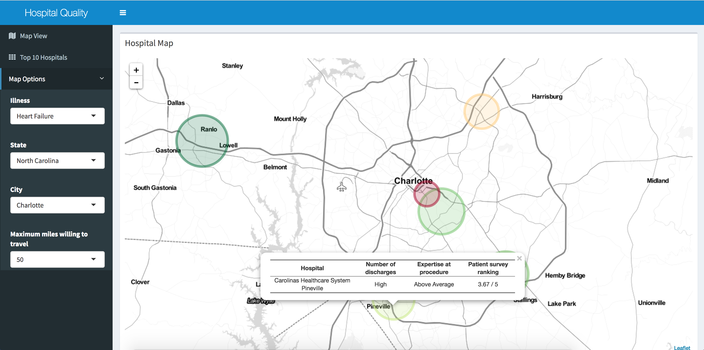

```{r setup, include=FALSE}
options(htmltools.dir.version = FALSE)
```

class: dv

# Who am I?

- Davis Vaughan

- Master's student in Quantitative Finance

- Passed P and FM

- Previously an intern at DataCamp

---

class: dv

# Who am I?

- R enthusiast

  - 3+ years of R programming

  - Co-author of 2 R packages (Currently this means nothing to you)
      - _tidyquant_ - Making financial analysis easier in R
      
      - _timetk_ - Helpers for time series analysis, and for forecasting using machine learning techniques
  
--

<br> 

.center[  
### Lot's of time banging my head against the wall fighting with R.
]
---

class: dv center middle

# Why am I here?

---

class: dv

# Why am I here?

.pull-left[

Part 1

- A high level intro to R

- What is R used for?

- Bells and whistles

]

--

.pull-right[

Part 2

- What is DataCamp? 

- What will you use it for?

- "Does this count as a grade?"

]

---

class: dv

# What on earth is R?

???

- If you're sitting there, asking yourself this question, that's fine. Let's give you a little bit of background. 

- So what is R? 

- Talk about airbnb pic

--

.pull-left[

_Historically:_

- A programming language

- Hard to learn syntax

- Used in academia and statistics

]

--

.pull-right[

_Currently:_

- A tool for data analysis

- Many easy tools to get started

- Widely used in industry

    - Uber, Liberty Mutual
  
]

--

.pull-down[
.center[
  
]]
  
---

class: dv

# Why should I care?

- Programming? I'm an actuary, I don't want to do that.

--

  - YES YOU DO
  
--

- Many actuarial calculations are well suited for R

  - Where Excel suffers, R shines
  
  - Recursive calculations (n depends on n-1)
  
  - Excel is just _slow_ compared to R
  
--

- New ASA requirements - Predictive Analytics Exam

  - Computer module _using R_
  
  - "Candidates will use computer packages to analyze data sets and then communicate their findings."


---

class: dv

# What can I use R for?

.pull-left[

- Generally a great tool for manipulating data...

]

--

.pull-right[

- ...and for performing complex calculations and analyses

]

--

.pull-down[
.center[
  
]
]

---

class: dv, center, middle

# Anything else?

---

# 1 - Beautiful visualizations

```{r, echo=FALSE, message=FALSE}
library(tidyquant)
library(highcharter)

data(FANG)

# Define what goes in the graph
hchart(FANG,
       hcaes(x = date, y = adjusted, group = symbol),
       type = "line") %>%
  # Axis titles
  hc_xAxis(title  = list(text = "")) %>%
  hc_yAxis(title  = list(text = "Adjusted Close Price")) %>%
  hc_title(text   = "FANG Stocks Over 10 Years") %>%
  # Zoom type
  hc_chart(zoomType = "x")
```

---

class: dv

# 1 - Beautiful visualizations

* A full suite of flexible graphing tools

```{r, echo=FALSE, message=FALSE, eval=FALSE}
mpg$cyl <- factor(mpg$cyl)

# Set the data source, and what goes on the X axis
ggplot(data = mpg, aes(x = cty)) +
  
    # Add a density chart, separated by cylinder
    geom_density(aes(fill = cyl), alpha = .8) +
  
    # Axis labels
    labs(title    = "Density plot",  
         subtitle = "City Mileage Grouped by Number of cylinders",
         x        = "City Mileage", 
         fill     = "# Cylinders")

ggsave("ggplot.png", width = 10, height = 6, units = "in")
```


---

class: dv

# 1 - Beautiful visualizations

* Fully customizable 

```{r, echo=FALSE, message=FALSE, eval=FALSE}
mpg$cyl <- factor(mpg$cyl)

# Get the lincoln logo
img <- png::readPNG("lfg-logo.png")
g <- rasterGrob(img, interpolate=TRUE)

# Set the data source, and what goes on the X axis
ggplot(data = mpg, aes(x = cty)) +
  
    # Add a density chart, separated by cylinder
    geom_density(aes(fill = cyl), alpha = .8) +
  
    # Axis labels
    labs(title    = "Density plot",  
         subtitle = "City Mileage Grouped by Number of cylinders",
         x        = "City Mileage", 
         fill     = "# Cylinders") +
  
    theme_lincoln() +
    scale_fill_lincoln() + 
    annotation_custom(g, xmin=33, xmax=36, ymin=.5, ymax=.55)


ggsave("ggplot-lincoln.png", width = 10, height = 6, units = "in")
```



---

class: dv 

# 2 - Reporting / Interactive dashboards



.footnote[
[Healthy Hive](https://healthyhive.shinyapps.io/Project005-ReadmissionTouchUp/)
]

???

- Another great feature of R is for reporting and dashboards using something like Shiny. 

- Show off the link, the entire site was created from R

- Notice how this is a URL, seemingly just any old website, running R in the background.

- Since R can connect to databases, you could imagine having something like a real time dashboard populated from data queried from your internal database.

- This reporting aspect of R is a great way for a developer to communicate their model results to upper management in a more earily digestable format.

---

class: dv

# 3 - Powerpoints? 

- R can do that?

--

  - Yes! This presentation was created in R.

--

- Why?

  - R code, right there, with results.

```{r, echo=FALSE}
library(broom)
```

```{r}
lm(cty ~ cyl, data = mpg) %>%       # Linear regression
  glance() %>%                      # Extract summary statistics
  select(adj.r.squared, p.value)    # Select 2 of them
```

---

class: dv

# How can R do so much, and still be free?

- Open source

  - Developers around the world contribute through _packages_

--

- Agh, I'm confused - Packages?

--

  - Collections of code that extend R

  - Written and reviewed by the community ( > 12,000 packages)

  - Generally a package _does one thing well_

--

- Examples

  - _ggplot2_ - Visualization
  
  - _dplyr / tidyr_ - Manipulating data (kind of like pivot tables)
  
  - _readr / readxl_ - Read in data sets (Text, Excel, SAS)

---

class: dv

# DataCamp

- "The easiest way to learn Data Science online!"

--
  
- The general idea:

  - Select a course, usually containing ~5 chapters

  - Watch a video on a concept
  
  - Practice that concept in the browser _by actually coding_
  
  - Get automated feedback on your mistakes
  
  - Rinse and repeat throughout the course
  
--

- A 5 chapter course takes ~4 hours

--
  
- Let's look at an example course

- [Writing functions in R](https://campus.datacamp.com/courses/writing-functions-in-r/a-quick-refresher?ex=1)


---

class: dv

# DataCamp

- Math 3129 will take two DataCamp classes to learn R

  - Introduction to R for Finance
  
  - Intermediate R for Finance
  
--
  
- Two courses for absolute beginners to get their feet wet with R with financial examples

--

- _Your course progress will be tracked_

- _Course completions + a case study will be 5% of your grade_

---

class: dv

# Timeline

.pull-left[

- 08/25/2017 
  - Intro to R for Finance assigned

- 09/01/2017
  - Ch1: _The Basics_
  - Ch2:  _Vectors and Matrices_
  - Ch3: _Data Frames_

- 09/08/2017 
  - Ch4: _Factors_
  - Ch5: _Lists_
  - Davis speaks + Intermed R for Finance assigned

]

.pull-right[

- 09/15/2017 
  - Ch1: _Dates_
  - Ch2: _If Statements and Operators_
  - Ch3: _Loops_
  
- 09/22/2017
  - Ch4: _Functions_
  - Ch5: _Apply_
  
- 09/27/2017

  - Case study assigned
  
- 10/27/2017

  - Case study due

]

---

class: dv

## Course progress

- DataCamp tracks course completion for us

- The timeline is a hard deadline, but feel free to go ahead

--

- You should have access to all 75+ courses

  - _Data Manipulation in R with dplyr_

  - _Joining Data in R with dplyr_

---

class: dv

# Other stuff

- Installing R and RStudio

  - I'll post some material on this
  
  - You don't have to right now, will need it for case study
  
--
  
- You should all get an email from DataCamp
  
  - Open it, it should add you to the group
  
  - You might get alot of assignment emails, sorry

--

- My email

  - mvaugh15@uncc.edu

---

class: dv

# Getting help

* If you get an error, google it.

* "How do I do [my thing] in R?"

* Stack Overflow

* [R 4 Data Science](http://r4ds.had.co.nz/)

* [Hands on Programming with R](https://d1b10bmlvqabco.cloudfront.net/attach/ighbo26t3ua52t/igp9099yy4v10/igz7vp4w5su9/OReilly_HandsOn_Programming_with_R_2014.pdf)

* If you really can't figure it out, email me. I'm happy to help.

---

class: dv, center, middle

# Questions?

