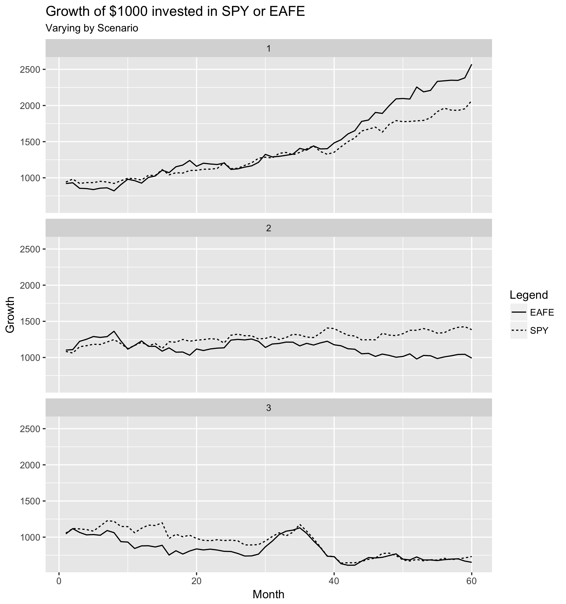

```{r setup, include=FALSE}
options(htmltools.dir.version = FALSE)
#xaringan::summon_remark(to = "r-tutorial/libs/")
```

class: dv
 
# What's on the agenda?

--

### Learning R!

--

.pull-left[

- Import

- Manipulate

]

.pull-right[

- Visualize

- Model

]

---

class: dv

# Import

--

- Text / CSV files
  
  - `readr` 
  
  - Tab, comma, space delimited

--

- Excel
  
  - `readxl`

  - Multiple sheets
  
  - xls or xlsx

--

- Access databases

  - `DBI` and `odbc`

---

class: dv

# Manipulate 

--

- Wrangle your data

  - `filter` for specific rows
  
  - `mutate` data sets to add or alter columns
  
  - `select` certain columns to work with

--
  
- Whatever this thing is
    
  - `%>%`
      
  - Hint: it's called a pipe - _Chaining_ operations

--

- Joining tables together

  - `left_join`, and `right_join`, and `anti_join`, oh my!
  
- Summary statistics

  - `group_by` - separate your dataset into distinct groups
  
  - `summarize` - calculate a 1 number summary for each group (mean)
  
---

class: dv

# Visualize

.pull-left[

- `ggplot2`

  - Scatter plots
  
  - Line graphs
   
- Multiple lines

  - Faceting - One graph per line
  
  - One graph with multiple lines

- Interactive ggplot graphs

  - `plotly` and `ggplotly`

]

--

.pull-right[



]

```{r, include=FALSE, eval=FALSE}
library(ggplot2)
library(readr)
library(readxl)
library(tidyverse)

de <- read_excel("data/example_de.xlsx")

rates <- read_csv("data/example_rates.csv")

rates <- rates %>%
  group_by(scenario) %>%
  mutate(
    growth_SPY  = cumprod(SPY + 1) * 1000,
    growth_EAFE = cumprod(EAFE + 1) * 1000
  )

rates_growth <- rates %>% 
  select(scenario, year, month, growth_EAFE, growth_SPY) %>%
  rename(EAFE = growth_EAFE, SPY = growth_SPY) %>%
  gather(key = growth, value = fund_value, -scenario, -year, -month)

rates_growth$scenario <- as.factor(rates_growth$scenario)

ggplot(rates_growth, aes(x = month, y = fund_value, linetype = growth)) + 
  geom_line() +
  facet_wrap("scenario", nrow = 3) + 
  labs(x = "Month", y = "Growth", 
       title = "Growth of $1000 invested in SPY or EAFE", 
       subtitle = "Varying by Scenario", 
       linetype = "Legend")

ggsave("img/ggplot_growth.png", height = 8, width = 7)

rates_growth %>% 
  filter(growth == "EAFE") %>%
  ggplot(aes(x = month, y = fund_value, color = scenario)) + 
  geom_line()
```

---

class: dv

# Model

* R comes with a number of statistical tools
  
  * `lm()` - Linear Regression
  
  * `glm()` - General Linear Model 
    
      * Logistic regression, Poisson, Gamma
  
--
  
* Packages provide more advanced tools

  * `ranger` - Random forests
  
  * `caret` - Tools to streamline the modeling process
  

---

class: dv, center, middle

# Let's get into it

[Basics](./2-r-basics.html)
  
  
  
  
  

