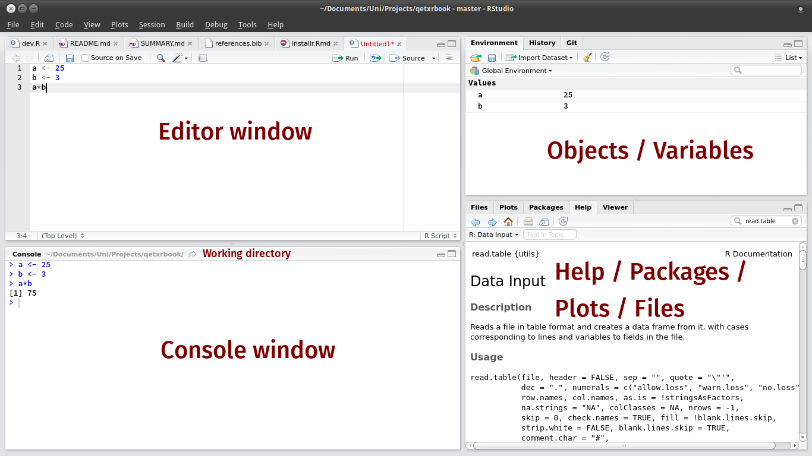

class: dv

# R and RStudio

* Installing R 

  * Instructions sent out with the meeting invite

* RStudio 
 
  * "Integrated Development Environment" 


---

class: dv

# R and RStudio

.center[

]

---

class: dv

# Installing packages

* "An R package is a collection of functions, data, and documentation that extends the capabilities of base R."

*  _Install_ packages once, then _library_ them whenever you want access to their functions.

--

* A few packages required for the talk

```{r, eval = FALSE}
# A collection of useful packages (ggplot2, dplyr, tidyr, ...)
install.packages("tidyverse")

# A dataset about flights
install.packages("nycflights13")
```

--

* Load the packages with `library()`

```{r, message = FALSE, warning = FALSE}
library(tidyverse)
library(nycflights13)
```


---

class: dv

# Variables

* A way to store data in R

* Created using the _assignment operator_ `<-`

--

```{r}
x <- 5
```

* The variable `x` now stores the number 5

--

.pull-left[

* Print the contents of `x`

```{r}
x
```

]

--

.pull-right[

* Manipulate `x` as if it were `5`

```{r}
x * 10

x + 2
```

]

---

class: dv

# Functions

* A piece of R code that should do 1 thing well

* Should have a descriptive name

* Takes _input_, returns a consistent _output_

* Black box to the user (but not really)

--

```{r, include=FALSE}
add_one <- function(value) {
  value + 1
}
```


```{r}
x <- 5

add_one(x)
```

--

* x = input
* 6 = output

---

class: dv

# Data frames / Tibbles

.pull-left[
* Tables in Excel
]

.pull-right[
* The most familiar way to store data
]

---  

```{r, eval = FALSE}
flights
```

```{r, echo = FALSE}
flights %>%
  select(year, month, day, dep_time, sched_dep_time, carrier, distance) %>%
  filter(!is.na(dep_time)) %>%
  tibble:::print.tbl(flights, n = 8)
```

---

class: dv

# Data frames / Tibbles

.pull-left[
* Another example
]

.pull-right[

]

--- 

```{r, eval = FALSE}
airlines
```

```{r, echo = FALSE}
tibble:::print.tbl(airlines, n = 8)
```


---

class: dv

# Quick summary

* Variables 

  * Used to store data by name
  
* Functions

  * Does one thing well
  
  * Black box, just worry about input/output for now
  
* Tibbles
  
  * Like _tables in Excel_
  
  * Hold data in rectangular blocks
  
---

class: dv, center, middle

# Next up.. 

[Import](3-import.html)


