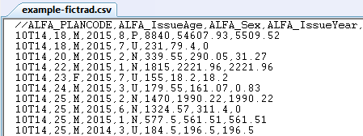
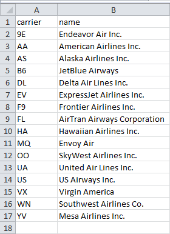
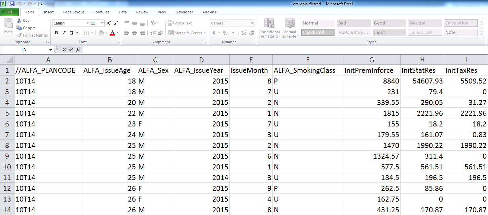
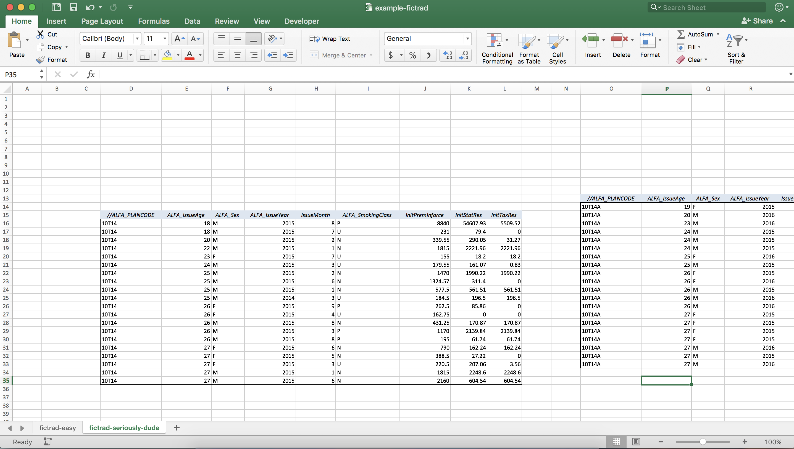

```{r, include=FALSE}
options(tibble.print_min = 6)
options(tibble.print_max = 6)
#library(tidyverse)
library(nycflights13)
library(readxl)

```


class: dv

# Importing data into R

--

* Data is read in as a _tibble_

--

* We will focus on:

  * `readr`
  
  * `readxl` / `openxlsx`
  
* We won't talk about:

  * `DBI` / `odbc` - Database connections
  
  * If interested, great docs here http://db.rstudio.com/

---

class: dv

# readr - Read CSV

* Reading and writing "flat" files

  * txt, csv, delimited
  
.center[

<br>

</img>
]

---

class: dv

# readr - Read CSV

* Reading and writing "flat" files

  * txt, csv, delimited

```{r, message=FALSE}
# Reading in a CSV
fictrad_csv <- read_csv(file = "data/example-fictrad.csv")

fictrad_csv
```

---

class: dv

# readr - Write CSV

* Reading and writing "flat" files

  * txt, csv, delimited

```{r}
airlines
```

```{r, eval=FALSE}
write_csv(x    = airlines, 
          path = "data/example-airlines.csv")
```

---

class: dv

# readr - Write CSV

* Reading and writing "flat" files

  * txt, csv, delimited

.center[

]


---

class: dv

# readxl / openxlsx

* `readxl` - Reading Excel files (xlsx and xls)

* `openxlsx` - Writing Excel files (xlsx)



---

class: dv

# readxl - Simple sheet

```{r}
fictrad_xl <- read_excel(path  = "data/example-fictrad.xlsx",
                         sheet = "fictrad-easy")

fictrad_xl
```

---

class: dv

# readxl - More difficult



---

class: dv

# readxl - More difficult

```{r}
# Include a range argument
fictrad_hard_1 <- read_excel(path  = "data/example-fictrad.xlsx",
                             sheet = "fictrad-hard",
{{                            range = "D5:L25"}})

fictrad_hard_2 <- read_excel(path  = "data/example-fictrad.xlsx",
                             sheet = "fictrad-hard",
{{                            range = "O3:W23"}})

fictrad_hard_1
```

---

class: dv

# openxlsx - Writing Excel files

* Writing the `airlines` dataset to Excel

```{r, eval = FALSE}
# install.packages("openxlsx")

library(openxlsx)

# Easy way
write.xlsx(x    = airlines, 
           file = "data/example-airlines.xlsx")

# Flexible way
# wb <- createWorkbook()          
# addWorksheet(wb, sheetName = "airlines_sheet")
# writeData(wb, sheet = "airlines_sheet", x = airlines)
# saveWorkbook(wb, file = "data/example-airlines.xlsx")
```

---

class: dv, middle, center

# Next up..

[Visualization](./4-visualize.html)

