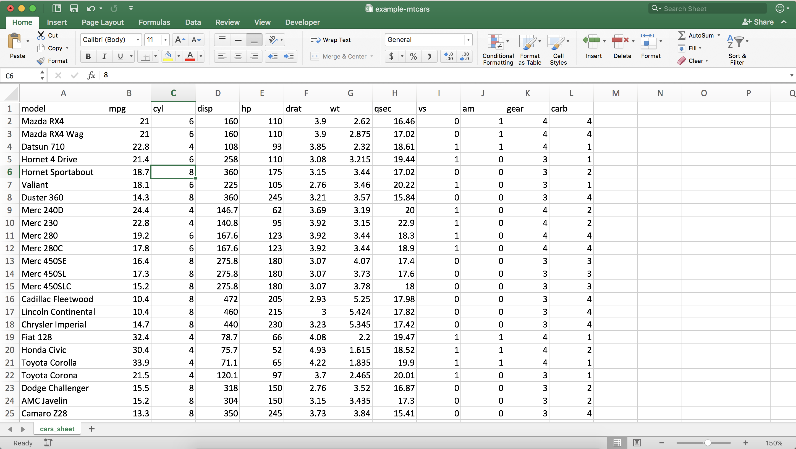

class: dv

# Importing data into R

* Tons of ways to import data into R

--

* Data is read in as _data frames_

--

* We will focus on:

  * `readr`
  
  * `readxl` and `openxlsx`
  
* We won't talk about:

  * `DBI` and `odbc` - Database connections

---

class: dv

# readr

* Reading in "flat" files

  * txt, csv, delimited

* Can also write these back out

---

class: dv

# readr - Read a CSV file

```{r, message=FALSE}
library(readr)

# Simple - Reading in a CSV
fictrad_csv <- read_csv(file = "data/example-fictrad.csv")

head(fictrad_csv, 4)
```

---

class: dv

# readr - Read a delimited file

```{r, message=FALSE}
library(readr)

# '#' as delimited
fictrad_delim <- read_delim(file  = "data/example-fictrad.txt",
{{                           delim = "#"}})

head(fictrad_delim, 4)
```

---

class: dv

# readr - Write a CSV

```{r, echo=FALSE, message=FALSE}
mtcars <- read_csv(file = "data/example-mtcars.csv") 
```


```{r}
head(mtcars, 2)
```

```{r, eval=FALSE}
write_csv(x    = mtcars, 
          path = "data/example-mtcars.csv")
```

---

class: dv

# readxl / openxlsx

* `readxl` - Reading Excel files (xlsx and xls)

* `openxlsx` - Writing Excel files (xlsx)

---

class: dv

# readxl - Simple sheet


---

class: dv

# readxl - Simple sheet

```{r}
library(readxl)

fictrad_xl <- read_excel(path  = "data/example-fictrad.xlsx",
                         sheet = "fictrad-easy")

head(fictrad_xl, 1)
```

---

class: dv

# readxl - More difficult


---

class: dv

# readxl - More difficult

```{r}
library(readxl)

fictrad_hard <- read_excel(path  = "data/example-fictrad.xlsx",
                           sheet = "fictrad-seriously-dude")

head(fictrad_hard, 1)
```

---

class: dv

# readxl - More difficult

```{r}
library(readxl)
# Include a range argument
fictrad_hard_1 <- read_excel(path  = "data/example-fictrad.xlsx",
                             sheet = "fictrad-seriously-dude",
{{                            range = "D15:L35"}})

fictrad_hard_2 <- read_excel(path  = "data/example-fictrad.xlsx",
                             sheet = "fictrad-seriously-dude",
{{                            range = "O13:W33"}})

glimpse(fictrad_hard_1) 
```

---

class: dv

# openxlsx - Writing Excel files

```{r, eval = FALSE}
library(openxlsx)

# Using mtcars again

# Create a blank Excel workbook
wb <- createWorkbook()

# Add a worksheet named cars_sheet
addWorksheet(wb, sheetName = "cars_sheet")

# Add the mtcars dataset to the sheet
writeData(wb, sheet = "cars_sheet", x = mtcars)

# Save and close the workbook
saveWorkbook(wb, file = "data/example-mtcars.xlsx")
```

---

class: dv

# openxlsx - Writing Excel files



---

class: dv, middle, center

# Next up..

[Manipulation](./4-manipulation.html)

