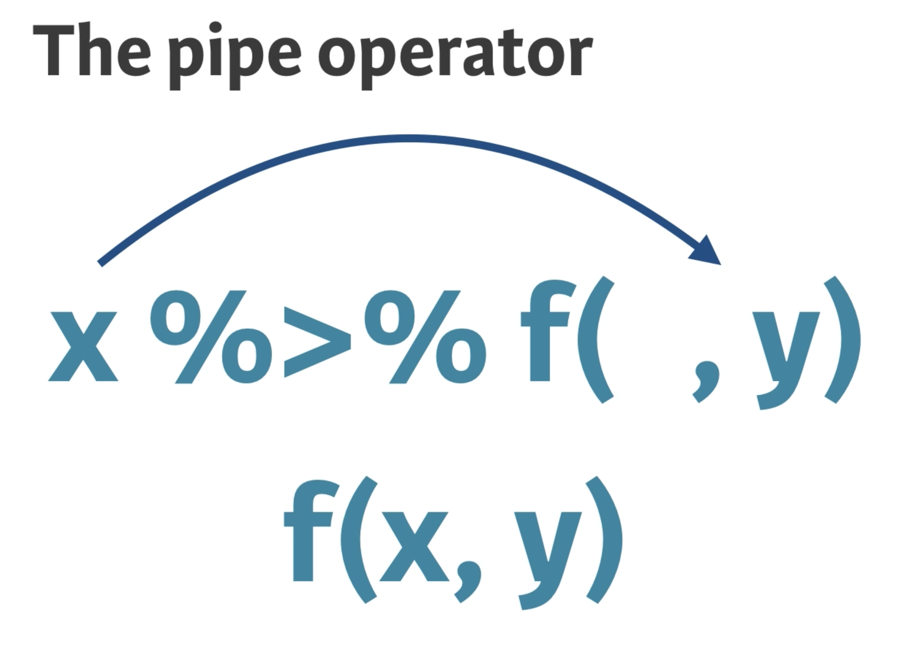

class: dv

# Manipulation using dplyr and tidyr

* Three main things to talk about

  * Data transformation
  
  * The pipe
  
  * Data tidying
  
---

class: dv

# Data - nycflights13
  
```{r, echo = FALSE, message=FALSE}
library(tidyverse)
library(nycflights13)

flights <- flights %>%
  select(year, month, day, dep_time, sched_dep_time, carrier, distance) %>%
  filter(!is.na(dep_time))
```

  
```{r, echo=FALSE, message=FALSE}
library(nycflights13)

rmarkdown:::print.paged_df(flights)

c(rows = dim(flights)[1], cols = dim(flights)[2])
```

---

class: dv

# select() columns

* Extract specific columns from your data frame

```{r}
# Store in a new data frame
yr_carrier <- select(.data = flights, year, carrier)

yr_carrier
```

---

class: dv

# The pipe %>%

--

.pull-left[

* The _object_ to the left of the pipe becomes the _first argument_ of the function on the right



]

--

.pull-right[

```{r}
# Readability is the 
# focus of the pipe!

flights %>%
  select(dep_time) %>%
  head(n = 4)

# head(select(flights, arr_time), 4)
```

]

---

class: dv

# filter() for specific rows

* Only American Airlines flights? (In Excel, might add a _filter_ on the table)

```{r}
AA <- filter(flights, carrier == "AA")
head(AA, 2)

# With pipes
flights %>%
  filter(carrier == "AA") %>%
  head(2)
```

---

class: dv

# arrange() to order rows 

* Order by distance? Lowest to highest? Vice versa?

```{r, include=FALSE}
# only a few rows so it can fit
options(tibble.print_min = 2)
```

```{r}
flights %>%
  arrange(distance)

flights %>%
  arrange(desc(distance))
```

```{r, include=FALSE}
# change default back
options(tibble.print_min = 10)
```

---

class: dv

# mutate() to add new columns

* The most important one so far!

```{r}
flights_late <- flights %>%
  
  mutate(
    
    # Time difference between actual and scheduled departure
    late_time    = dep_time - sched_dep_time,
         
    # This flight was x% late
    percent_late = late_time / sched_dep_time * 100) %>%
  
  # Relevant columns
  select(dep_time, sched_dep_time, late_time, percent_late)
```

---

class: dv

# mutate() to add new columns

```{r, echo=FALSE}
rmarkdown:::print.paged_df(flights_late)
```

---

class: dv

# mutate() and case_when()

* Imagine doing this with Excel formulas - nested If/Or

```{r}
flights_cat <- flights %>% 
  
  mutate(
    
    # This flight was x% late
    percent_late  = (dep_time - sched_dep_time) / sched_dep_time * 100,
    
    # Separate the flights into 3 categories
    late_category = case_when(
      percent_late <= 0  ~ "early",
      percent_late < 50  ~ "late",
      TRUE               ~ "really late")
  ) %>%
  
  # Only select relevant columns
  select(dep_time, sched_dep_time, percent_late, late_category)
```

---

class: dv

# mutate() and case_when()

```{r, echo = FALSE}
rmarkdown:::print.paged_df(flights_cat)
```

---

class: dv

# group_by() and summarize()

* Often, data sets are grouped and aggregated to get a coarser level of insights

* Think _pivot tables_ from Excel

* In R, these manipulations are accomplished using _grouped data frames_.

---

class: dv

# group_by() and summarize()

* For `flights`, what if we wanted the average `distance` for each `month`?

```{r}
flights %>%
  
  # Group rows by year 2013, 2014, ...
  group_by(month) %>%
  
  # For each group, calculate the average distance
  summarize(avg_distance = mean(distance)) %>%
  
  print(n = 12)
```


---

class: dv

# Tidy data

* There are three interrelated rules which make a dataset tidy:

      1. Each _variable_ must have its own _column_.

      2. Each _observation_ must have its own _row_.
  
      3. Each _value_ must have its own _cell_.
    


* Tidy data makes your analysis steps feel natural

---

class: dv

# Tidy VS Untidy examples

```{r}
library(readxl)
de <- read_excel(path = "data/example_de.xlsx")

de
```


