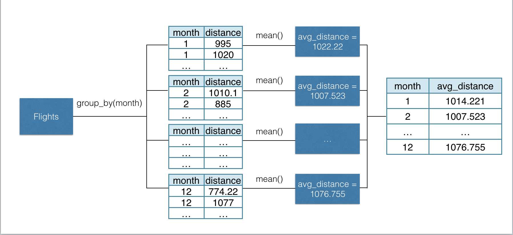

class: dv

# Manipulation using dplyr and tidyr 

* Three main things to talk about

  * Data transformation (verbs)
  
  * The pipe
  
  * Data tidying
  
---

class: dv

# Data - flights from nycflights13
  
```{r, echo = FALSE, message=FALSE, warning=FALSE}
# library(tidyverse)
# library(nycflights13)
# 
# flights <- flights %>%
#   select(year, month, day, dep_time, sched_dep_time, carrier, distance) %>%
#   filter(!is.na(dep_time))

library(nycflights13)
library(tidyverse)

flights <- readr::read_csv("data/example-flights-full.csv")
 
flights<-flights %>%
  filter(!is.na(dep_time)) %>%
  mutate(minute_real = substr(dep_time, nchar(dep_time)-1, nchar(dep_time)),
         minute_real = ifelse(is.na(as.numeric(minute_real)), 0, as.numeric(minute_real)),
         hour_real   = substr(dep_time, start = 1, stop = nchar(dep_time)-2),
         hour_real = ifelse(is.na(as.numeric(hour_real)), 0, as.numeric(hour_real)),
         dep_time2    = as.numeric(hour_real) * 60 + as.numeric(minute_real),
         sched_dep_time2 = as.numeric(hour) * 60 + as.numeric(minute),
         delay = dep_time2 - sched_dep_time2, 
         diff = delay - dep_delay) %>%
  mutate(dep_time_fix = ifelse(diff != 0, dep_time2 - diff, dep_time2),
         delay2 = dep_time_fix - sched_dep_time2, 
         diff2 = delay2 - dep_delay) %>%
  mutate(dep_time = dep_time_fix,
         sched_dep_time = sched_dep_time2) %>%
    select(year, month, day, dep_time, sched_dep_time, carrier, distance)

```

```{r, eval=FALSE}
flights
```
  
```{r, echo=FALSE, message=FALSE}
library(nycflights13)

rmarkdown:::print.paged_df(flights)

c(rows = dim(flights)[1], cols = dim(flights)[2])
```

---

class: dv

# select() columns

<br>
<br>


---

class: dv

# select() columns

* Extract specific columns

```{r}
# Select year and carrier
select(.data = flights, year, carrier)
```

---

class: dv

# The pipe %>%

--

.pull-left[

* The _object_ to the left of the pipe becomes the _first argument_ of the function on the right

* Take `x` _and then_ do `f` to it


]

--

.pull-right[

```{r}
# Readability is the 
# focus of the pipe!

flights %>%
  select(dep_time) %>%
  head(4)

# depart <- select(flights, dep_time)
# head(depart 4)
```

]

---

class: dv

# The pipe %>%

.pull-left[

* The _object_ to the left of the pipe becomes the _first argument_ of the function on the right

* Take `x` _and then_ do `f` to it


]

.pull-right[


]

---

class: dv

# filter() for specific rows

<br>
<br>


---

class: dv

# filter() for specific rows

* Only American Airlines flights? (In Excel, might add a _filter_ on the table)

```{r}
AA <- filter(flights, carrier == "AA")
head(AA, 2)
```

--

```{r}
# With pipes
flights %>%
  filter(carrier == "AA") %>%
  head(2)
```

---

class: dv

# A question

* Can we categorize flights as:

  * early
  
  * late 
  
  * really late

* Can we quantify "late" and "really late"?

```{r, eval = FALSE}
flights
```

```{r, echo= FALSE}
tibble:::print.tbl(flights, n = 6)
```

---

class: dv

# mutate() to add new columns

<br>
<br>


---

class: dv

# mutate() to add new columns

```{r}
flights_late <- flights %>%
  mutate(delay = dep_time - sched_dep_time)

flights_late
```

---

class: dv

# mutate() to add new columns

* Of the flights that are late, define the 75th percentile to be "really late"

* How late is the 75th percentile?

```{r}
flights_late %>%
  filter(delay > 0) %>%  # Ignore flights that were early
  pull(delay) %>%        # Pull only the delay column
  quantile()             # Calculate the quantiles
```

---

class: dv

# Three "cases" to categorize

* Case 1: 

  * IF `delay <= 0`
  
  * THEN `early`
  
* Case 2: 
  
  * IF `delay <= 50` 
  
  * THEN `late`
  
* Case 3: 
  
  * OTHERWISE `really late`

---

class: dv

# How might we do this in Excel?

* First attempt

```{r, eval = FALSE}
=IF(H2 <= 0, "early", IF(AND(H2>0, H2<=50), "late", IF(H2>50,"really late")))
```

--

* If you know about ALT+ENTER to align nicely

```{r, eval = FALSE}
=IF(H2 <= 0,           "early", 
 IF(AND(H2>0, H2<=50), "late", 
 IF(H2>50,             "really late")))
```

--

* If you understand that the order matters

```{r, eval = FALSE}
=IF(H2<=0, "early",
 IF(H2<=50,"late",
           "really late"))
```

---

class: dv

# Even Excel knows the deal

--

* Error prone:

  * "It might work 75% of the time, but return unexpected results 25% of the time. _Unfortunately, the odds of you catching the 25% are slim._"

--

* Maintenance / Documentation

  * "Multiple IF statements can become incredibly difficult to maintain, _especially when you come back some time later and try to figure out what you, or worse someone else, was trying to do._"

--

* Speed

  * They are really slow. >1 second for 3 conditions and ~320,000 rows

--

* Just don't

  * "If you find yourself with an IF statement that just seems to keep growing with no end in sight, _it’s time to put down the mouse and rethink your strategy._"


---

class: dv

# mutate() and case_when()

```{r}
flights_cat <- flights_late %>% 
  mutate(
    
    # Separate the flights into 3 categories
    late_category = case_when(
      delay <= 0   ~ "early",             # Early if negative delay
      delay <= 50  ~ "late",              # Late if below 75th percentile
      TRUE         ~ "really late")) %>%  # Really late otherwise
  
  # Only select relevant columns
  select(dep_time, sched_dep_time, delay, late_category)
```


```{r, echo=FALSE}
start <- proc.time()

flights_cat <- flights_late %>% 
  mutate(
    
    # Separate the flights into 3 categories
    late_category = case_when(
      delay <= 0   ~ "early",             # Early if negative delay
      delay <= 50  ~ "late",              # Late if below 75th percentile
      TRUE         ~ "really late")) %>%  # Really late otherwise
  
  # Only select relevant columns
  select(dep_time, sched_dep_time, delay, late_category)

proc.time() - start
```

--

<br></br>

* Readability / Comments

* Scalable / Speed

---

class: dv

# mutate() and case_when()

```{r, echo = FALSE}
rmarkdown:::print.paged_df(flights_cat)

flights_cat %>% count(late_category)
```

---

class: dv

# group_by() and summarize()

* Often, data sets are grouped and aggregated to get a coarser level of insights

* Think _pivot tables_ from Excel

* In R, these manipulations are accomplished using _grouped data frames_.


---

class: dv

# group_by() and summarize()

* For `flights`, what if we wanted the average `distance` for each `month`?


```{r, eval = FALSE}
flights_late %>%
  group_by(month) %>%                      # Group rows by month 1, 2, ..., 12
  summarize(avg_distance = mean(distance), # For each group, avg distance
            avg_delay    = mean(delay))
```

```{r, echo=FALSE}
flights_late %>%
  group_by(month) %>%                      # Group rows by month 1, 2, ..., 12
  summarize(avg_distance = mean(distance), # For each group, avg distance
            avg_delay    = mean(delay)) %>%
  tibble:::print.tbl(n = 12)
```

---

class: dv

# group_by() and summarize()



---

class: dv

# Tidy data

* There are three interrelated rules which make a dataset tidy:

      1. Each _variable_ must have its own _column_.

      2. Each _observation_ must have its own _row_.
  
      3. Each _value_ must have its own _cell_.
    


* Tidy data makes your analysis steps feel natural

---

class: dv

# Tidy VS Untidy example

```{r}
library(readxl)
de <- read_excel(path = "data/example_de.xlsx")

head(de)
```

* Not tidy! Think about performing a `group_by` to get the average de for each product. Can't group on columns!

---

class: dv

# Tidying up - gather() and spread()

<br></br>


---

class: dv

# Tidying up - gather() and spread()

* `gather()` multiple columns together

```{r}
de %>% 
  gather(key = product, value = de, -scenario, -year)
```

---

class: dv

# Tidying up - gather() and spread()

```{r}
library(FinCal)
de %>% 
  gather(key = product, value = de, -scenario, -year) %>%
  group_by(product, scenario) %>%
  summarise(pvde = pv.uneven(r = .05, cf = -de))
```

<br></br>

* Also, visualizations are built around data being in this form

---

class: dv

# Tidying up - gather() and spread() 

* `spread()` is the complement to `gather()`


---

class: dv

# Tidying up - gather() and spread()

* `spread()` is the complement to `gather()`

```{r}
library(FinCal)
de %>% 
  gather(key = product, value = de, -scenario, -year) %>%
  group_by(product, scenario) %>%
  summarise(pvde = pv.uneven(r = .05, cf = -de)) %>%
  spread(key= product, value = pvde)
```

---

class: dv

# Wrap up

* What is a tibble / data frame?

* How to install a package?

--

* Basic visualization with ggplot2 

  * Scatter plot
  
  * Line graph
  
  * Bar chart

* Faceting

--

* Data manipulation

  * mutate
  
  * group_by + summarize
  
  * gather + spread

---

class: dv

# Thank you!

* Help document with more R references

* Stack Overflow + Google solve everything

* I'm here until tomorrow

