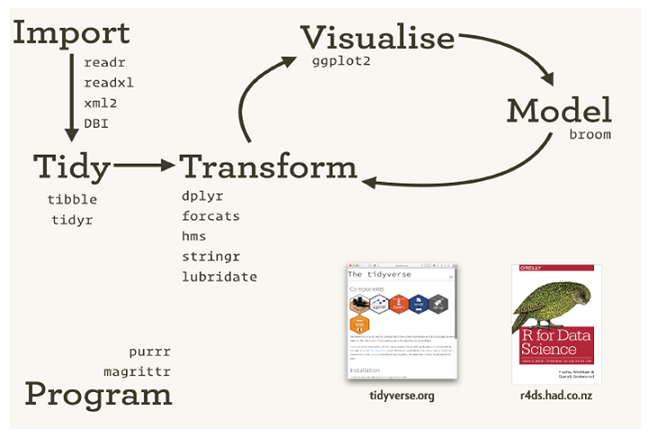
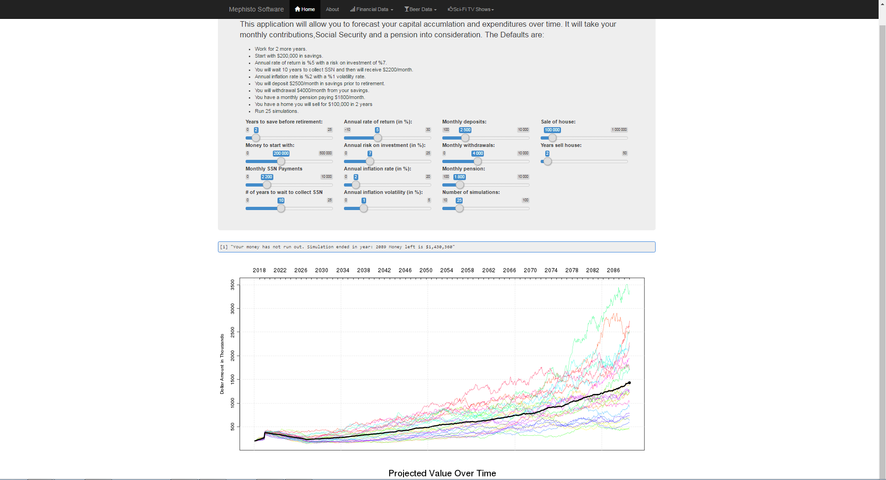

```{r setup, include=FALSE}
options(htmltools.dir.version = FALSE)
```

class: dv

# Who am I?

???

- Thank you all for being here today

- Acutely aware that the word packages mean nothing to you right now

- tidyquant is my way of giving back to the R community to try and help make financial analysis in R a little bit easier.

- timekit provides some helper functions for time series analysis

- Probably the most important thing on this slide, I've spent alot of time trying to master the syntax of R, and finding resources to help me along the way. In my experience, you will run into things you don't understand, and for awhile you'll look like a deer caught in headlights, but one of the best things about R is the active community asking questions all across the internet, so your question has likely already been answered, and is probably just a google search away.

--

- Davis Vaughan

- Actuarial intern in ALM

- Master's student at UNC Charlotte

- Previously an intern at DataCamp

---


class: dv

# Who am I?

???

- Thank you all for being here today

- Acutely aware that the word packages mean nothing to you right now

- tidyquant is my way of giving back to the R community to try and help make financial analysis in R a little bit easier.

- timekit provides some helper functions for time series analysis

- Probably the most important thing on this slide, I've spent alot of time trying to master the syntax of R, and finding resources to help me along the way. In my experience, you will run into things you don't understand, and for awhile you'll look like a deer caught in headlights, but one of the best things about R is the active community asking questions all across the internet, so your question has likely already been answered, and is probably just a google search away.

--

- R enthusiast

  - 3+ years of R programming

  - Co-author of 2 R packages (Currently this means nothing to you)
      - _tidyquant_ - Making financial analysis easier in R
      
      - _timekit_ - Helpers for time series analysis, and for forecasting using machine learning techniques
  
--
  
- Lot's of time banging my head against the wall while battling R

---

class: dv center middle

# Why am I here?

--

# I just really like R

---

class: dv

# Why am I here?

???

- Bells: Show off some visualizations, something called shiny, and teach you a bit about collaboration with R

- Other companies: Airbnb

- 2 projects so far

- Resources to learn R

- Importantly, NOT here to teach a programming class

--

.pull-left[

Part 1

- A high level intro to R

- What is R used for?

- Bells and whistles

]

--

.pull-right[

Part 2

- What other companies use R for

- What I've used R for at Lincoln

- How can you learn to use R?

]

<br>

--

.center[
__I'm not here to teach a programming class!__
]

---

class: dv

# What the heck is R?

???

- If you're sitting there, asking yourself this question, that's fine. Let's give you a little bit of background. 

- So what is R? 

- Talk about airbnb pic

--

_Some background:_

.pull-left[

- A programming language

- Historically used in academia and statistics

- Historically hard to learn / strange syntax

]

--

.pull-right[

- Currently used for _data analysis_

    - Uber, Amgen, [Liberty Mutual](https://www.rstudio.com/resources/customer-spotlight/liberty-mutual-story/)
  
- Much easier to get started

]

--

.pull-down[
.center[

]
]
  
---

class: dv

# What can I use R for?

???

- It can function like a programmatic pivot table from excel, but in reality it can do so much more.

- Things like regression, random forests, simulations, or survival analysis are only a function call away

- There is this great data analysis work flow that applies if youre doing data analysis, no matter what field you work in. 
  - Its a cycle, the 3 steps are not something you get right the first time around.
  
- What you see underneath these headings are packages, that word I mentioned earlier that I said you wouldnt understand. I'll get to them later, but just know that there are dedicated resources in R designed to help with each one of these steps.

--

.pull-left[

- Generally a great tool for manipulating data...

]

--

.pull-right[

- ...and for performing complex calculations and analyses

]

--

.pull-down[
.center[
  
]
]

---

class: dv, center, middle

# Anything else?

???

- So it sounds like R can be a tool in my data analysis toolbox. Maybe it could be something to use instead of Excel. But is that all it does? Is there anything else?

- Absolutely! Lets look at some examples.

---

# 1 - Beautiful visualizations

```{r, echo=FALSE, message=FALSE}
library(tidyquant)
library(highcharter)

data(FANG)

# Define what goes in the graph
hchart(FANG,
       hcaes(x = date, y = adjusted, group = symbol),
       type = "line") %>%
  # Axis titles
  hc_xAxis(title  = list(text = "")) %>%
  hc_yAxis(title  = list(text = "Adjusted Close Price")) %>%
  hc_title(text   = "FANG Stocks Over 10 Years") %>%
  # Zoom type
  hc_chart(zoomType = "x")
```

???

- One thing R is well known for is its beautiful graphics, so i figured id give you one example of that to start.

- This is a graph of 4 stocks, over the past 10 years. It's created using something called dygraph, and its even interactive.

- SHOW OFF DYGRAPH

---

class: dv

# 1 - Beautiful visualizations

???

- If youre sitting there thinking, im not a programmer, ill never be able to do that, just look at the amount of code it took me to produce this.

--

I'll never be able to do that...

--

```{r}
# Required packages
library(tidyquant)
library(highcharter)

# Dataset included in one of the packages
data(FANG)

# Let's take a look at the first few rows...
head(FANG)
```

---

class: dv

# 1 - Beautiful visualizations

I'll never be able to do that...


```{r, echo=TRUE, eval = FALSE, message=FALSE}
# Define what goes in the graph
hchart(FANG,
       hcaes(x = date, y = adjusted, group = symbol),
       type = "line") %>%
  # Axis titles
  hc_xAxis(title  = list(text = "")) %>%
  hc_yAxis(title  = list(text = "Adjusted Close Price")) %>%
  hc_title(text   = "FANG Stocks Over 10 Years") %>%
  # Zoom type
  hc_chart(zoomType = "x")
```

--

The best part? Easily reproducible. And easily updated with new data.

---

class: dv 

# 2 - Reporting / Interactive dashboards



.footnote[
[Mephisto Software](http://www.mephistosoftware.com/shiny/retsim/)
]

???

- Another great feature of R is for reporting and dashboards using something like Shiny. 

- Show off the link, the entire site was created from R

- Notice how this is a URL, seemingly just any old website, running R in the background.

- Since R can connect to databases, you could imagine having something like a real time dashboard populated from data queried from your internal database.

- This reporting aspect of R is a great way for a developer to communicate their model results to upper management in a more earily digestable format.

---

class: dv

# 3 - Powerpoints? 

???

- There are a number of ways to create presentations in R, im using something relatively new called xaringan.

- You might be wondering, why would I ever want to do that? I promise, im not insane. There are a few reasons. One is portability. You can host these powerpoints on the web, and interact with them from a browser. In this way, you dont have to worry about the presentation looking different on a different version of powerpoint, or maybe you had it on a Mac running Keynote and need to use a PC. That wouldnt work, so in this case R's presentation feature abstracts away all that.

- Another reason is that code can be shown, and run, right there in the presentation. When I typed this up, i didnt include that output, R did it for me.

--

- R can do that?

--

- Yes! This presentation was created in R.

--

- Even better, it's hosted in the browser. No more dealing with presentations looking different on different machines.

- Why? R code, right there, with results.

```{r}
my_variable <- "hello world"

my_variable
```

---

class: dv

# 4 - Collaboration / Version control

???

What is github? Github is a programmer's best friend. If youve never heard of it, its a great place to host any code, like R code, and it has a few key functions. 

1) Its a great backup for your code, so if you need to move from one computer to another, you can. Its also faster than the network drive, so thats always good. 

2) It uses Git for version control, meaning that if you screw something up in your code, you can always roll it back to any point in time, and start over. This is priceless, and has saved me a number of times. 

3) I assume alot of you have heard of Alfa's Model Development software that the ALM group is reviewing. From what I've seen, it follows the same workflow as github - Branch off of Master when you want to create a new feature, work on it, rebase to get any changes that have happened in Master since you branched, and then merge back into master. This workflow is what allows multiple people to work on the same project at once, and it applies to R as well as Alfa.

Alot of people wonder if github is secure enough for their companies' code. Id argue yes, just based on the list of clients that the Github Enterprise software claims to have. I dont think that NASA or Airbnb would use it unless they thought it was secure.

--

- Github - A programmer's best friend.
  
--

  - A backup of your code

  - Version control for when you really screw something up

  - Branch / Rebase / Merge workflow for collaboration (Model Development anyone?)

--

- Is it secure?
  - Yes, [Github Enterprise](https://enterprise.github.com/home) is used by companies such as NASA, SAP, Airbnb, etc to host their code

--

- Is it easy?
  - Eh - Is anything at first?
  
  - Luckily, built in support in RStudio

--

- Is it worth it?
  - Absolutely.

---

class: dv

# How can R do so much, and still be free?

???

At this point, you might be wondering how on earth R can do so much and still be free. The correct answer actually comes from the question. Its because R is open source and free that it can do so much. I think its finally time to talk a little bit about packages.

Agh more jargon, yes what the heck is a package? 

--

- Open source

  - Developers around the world contribute through _packages_

--

- Agh, more jargon - Packages?

--

  - Collections of code that extend R

  - Written and reviewed by the community

  - Generally a package _does one thing well_

--

- Examples

  - _ggplot2_ - Visualization
  
  - _dplyr / tidyr_ - Manipulating data (kind of like pivot tables)
  
  - _readr / readxl_ - Robustly read in data sets (Text, Excel, SAS)
  
  - _Rcpp_ - An R interface to C++ (speed up code!)

---

class: dv

# How is R used out there in the real world?

???

So, now that you know about packages, I feel comfortable talking about how R is used out there in the real world. I'm going to use airbnb as my case study. They have something called a knowledge repo, which works something like this. Say Bob wants to work on an analysis, maybe he's interested in analyzing the output of some Alfa projections. So he takes the data into R, does his analysis, while providing plenty of comments along the way, and when he's finished, he can submit that analysis to the knowledge repo, where others throughout the company can view it, comment on it, and search for other analyses that they are interested in. This is by far the fastest way to spread information throughout a company, and it forces you to take some time thinking about telling a story with your analyses so that other's can understand what youre doing and why youre doing it. 

It also means that when you look back on that 6 months from now, you can instantly catch back up on the code you wrote, because you commented it thoroughly. 

Airbnb set up their own Knowledge Repo, but recently, RStudio has created a paid service called RStudio Connect, which can basically set all of this up for you, and you can submit your reports, or shiny dashboards like i showed earlier, right from R.

The other piece Id like to talk about is airbnb's internal package, Rbnb. While most developers release their packages for everyone to use, that doesnt mean that they have to. Its becoming more common for companies to develop their own internal packages for company use. In Airbnb's case, their package mainly focuses on the pieces you see here.....

--

[__Airbnb:__](https://medium.com/airbnb-engineering/using-r-packages-and-education-to-scale-data-science-at-airbnb-906faa58e12d) 

--

- _Knowledge Repo_ - A central hub of company information / analyses / reports, all written in R.

  - "As of today, our internal Knowledge Repo has nearly 500 R Markdown research reports using the Rbnb package."

--

- _Rbnb_ - An internal R package that functions as:

      - A consistent workflow to move data between different places in our data infrastructure

      - Branded visualization themes, scales, and geoms for ggplot2

      - R Markdown templates for different types of reports

      - Custom functions to optimize different parts of our workflow

---

class: dv

# [RStudio Connect](https://www.rstudio.com/products/connect/)

???

Instead of blabbing about it, im just going to show you this quick video.

--

- Highlights
    - Company wide hosting of reports and Shiny applications
    
    - Schedulable / Emails
    
    - Controlled access to all content - IT is happy
    
    - Push button deployment

--

- Scaling R Shiny processes

- R Markdown reports

- Annual Cost

    - 20 users   = $15k 
    
    - 100 users  = $25k 
    
    - Enterprise = ~$85k?
    
---

class: dv

# How have I used R so far at Lincoln?

???

Right, so right now its a very manual process, so lets see what I came up with.

--

_Project 1: Interactive reporting using R and Shiny_

--

  - _Data:_ 
  
      - 60+ raw ARS text files from Alfa containing 50 years of forecasted monthly book value and yield data for a set of Lincoln portfolios

--

  - _Current process:_
  
      - An Excel workbook where the 60 files are copied in, references are manually set, and charts have to be somewhat manually updated.

--

  - _Challenge:_ 
  
      - Create an automated process to aggregate _yearly_ book value and yield data for each portfolio, then display those results in a way to compare this set of 50 year forecasts to previous sets. 
      
      - Make it easy to run the analysis again next quarter with new data.
  
---

class: dv

# Project 1 - Solution

--

- _Data:_ 
  
  - The text files are dropped into a named folder (Example: "ARS-1q17")

--
    
- _New process - 2 parameterized R scripts:_

  1 - Summarize:
      
      - Pulls in all 60 files and combines them into 1 dataset
        
      - Calculates yearly book value and yield data
      
      - Exports them to Excel and Rds (R data set) files

  2 - Visualize:
  
      - Use the Shiny R package to create an [interactive web visualization](https://davisvaughan.shinyapps.io/3-Compare-Blends/) of the results
      
      - Compare this set of results to previous years
      
      - Combine multiple portfolios together to see how they might perform in aggregate

---

class: dv

# How have I used R so far at Lincoln?

???

Its important to note that we couldn't use the IRR function from Excel here. In some cases, the IRR wasn't used to discount for the entire period, but instead a negative discount rate was used if the cumulative discounted cash flow ever fell below 0.

--

class: dv

_Project 2: IRR calculations with variable discount rates_

--

  - _Data:_ 
  
      - 12 Lincoln products, 200 scenarios - Each forecasting 40 years of distributable earnings (cash flows)
      
      - For each of the 12 products, there is a GAAP Equity value (initial investment)
--

  - _Current process:_
  
      - An Excel workbook where the IRR is calculated for the 2400 total scenarios using goal seek
      
      - Cannot use the IRR function in Excel. We want to change to a low discount rate (5%) if cumulative cash flows drop below 0
      
      - __Each product takes 15 minutes to run. 12 products. 3 hours total!__

--

  - _Challenge:_ 
  
      - Basically, can R do this faster?

---

class: dv

# Project 2 - Solution

???

So how did I use R to solve this one? Let's walk through it. 

Really this is optimizing that formula squared, so that the value is floored at 0, and doesn't go negative right? Since the whole point is to make this difference equal to 0 by changing the IRR.

So what were the results? Drastic, to say the least. We went from a 5-10 minute excel macro, down to a 9 second execution in R. How? A few things, but it mainly boils down to R being vectorized, and having access to a package that lets R run in parallel. For the parallel part, since I have 4 cores on my machine, I was able to distribute the load of this problem equally across the cores, so each core worked on 2400 / 4 optimizations, then returned it back to me at the end.

--

- _Data:_ 
  
  - One Excel workbook containing:
  
      - The distributable earnings for all of the products and scenarios
      
      - The GAAP equity value for each product

--
    
- _New process - 1 R script:_

  - Optimization problem! For each of the 2400 scenarios, minimize:
  
      - `PV(distributable_earnings) - GAAP_equity`
      
      - By varying the IRR to discount with
      
      - Use the R function `optimize()`

--

- _Result:_

  -  __This takes 9 seconds in R__
  
  - How? R is _vectorized_ and can run _in parallel_ if you set it up correctly

---

```{r fig.width=30, fig.height=20, echo=FALSE}
library(jpeg)
library(grid)
img <- readJPEG("not-bad.jpg")
grid.raster(img)
```

???

No joke, my face looked exactly like this the first time it finished.

---

class: dv

# To learn more...

Hopefully I've been able to show you some benefits of using R.

If you want to learn more:

- Another meeting to actually learn the basics of an analysis in R

- https://www.datacamp.com is a paid ($29/month for everything) but great source of practice / videos

- http://r4ds.had.co.nz/ - A free book by the R expert himself, Hadley Wickham. A great source of information into something called the _tidyverse_, the easiest and most intuitive way to program with R

- Stack Overflow for answers to specific questions when you get stuck

- Just ask! I'm always happy to answer any questions

---

class: dv, center, middle

# Thank you!

---

class: dv, center, middle

# Questions?

